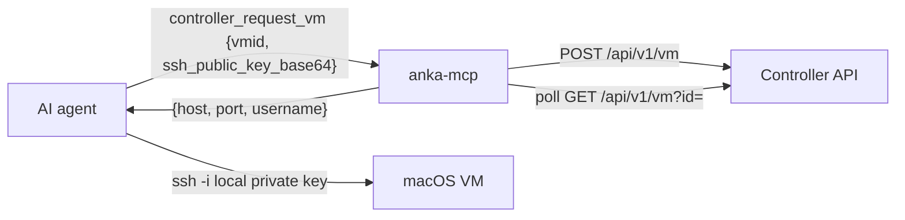

# anka-mcp

A [Model Context Protocol](https://modelcontextprotocol.io) (MCP) server for [Anka](https://veertu.com/) macOS virtualization. It runs as a **streamable HTTP server** with bearer-token auth and exposes two curated, purpose-built tool sets that auto-enable based on configuration:

- **Controller backend** - talks to the [Anka Build Cloud Controller](https://docs.veertu.com/anka/anka-build-cloud/working-with-controller-and-api/) REST API to request a VM from a fleet and hand back SSH connection details. No `anka` CLI is used.
- **Local backend** - drives the local `anka` CLI with a small, safe set of lifecycle commands, guarded by a running-VM limit.

There is intentionally no generic "run any anka command" tool.

## Backends and when they enable

| Backend    | Enabled when                                              | Tools |
| ---------- | --------------------------------------------------------- | ----- |
| Controller | `ANKA_CONTROLLER_URL` is set                              | `controller_list_templates`, `controller_request_vm`, `controller_get_vm`, `controller_terminate_vm` |
| Local      | `ANKA_LOCAL=on`, or `auto` when no controller is configured (detects the `anka` CLI) | `local_list_templates`, `local_start_vm`, `local_show_vm`, `local_ssh_access`, `local_delete_vm` |

When `ANKA_CONTROLLER_URL` is set, the local backend defaults to **off** so only controller tools are exposed. Set `ANKA_LOCAL=on` or `ANKA_LOCAL=auto` to enable both. The server refuses to start if neither backend is enabled.

## Requirements

- Node.js >= 18
- For the local backend: the `anka` CLI installed and on `PATH` (or point `ANKA_BIN` at it)
- For the controller backend: network access to an Anka Build Cloud Controller

## Install and run

### From npm

Requires Node.js >= 18.

```bash
# run without a global install
npx @veertu/anka-mcp

# or install globally
npm install -g @veertu/anka-mcp
anka-mcp
```

Set auth and backend env vars before starting (see [Configuration](#configuration)). Example:

```bash
export MCP_AUTH_TOKEN="$(openssl rand -hex 32)"
echo "MCP_AUTH_TOKEN=$MCP_AUTH_TOKEN"
anka-mcp
```

### From source (contributors)

```bash
npm install
npm run build
export MCP_AUTH_TOKEN="$(openssl rand -hex 32)"
echo "MCP_AUTH_TOKEN=$MCP_AUTH_TOKEN"
npm start
```

For **multi-client** deployments, use the admin API instead of a single shared token:

```bash
export MCP_ADMIN_TOKEN="$(openssl rand -hex 32)"
export ANKA_CONTROLLER_URL="http://your-controller:8090"
npm start

# Create a per-client MCP token (plaintext shown once):
curl -s -X POST "http://localhost:9111/admin/tokens" \
  -H "Authorization: Bearer $MCP_ADMIN_TOKEN" \
  -H "Content-Type: application/json" \
  -d '{"label":"team-a"}'
```

The MCP endpoint is served at `http://<host>:<port>/mcp`. An unauthenticated status endpoint at `http://<host>:<port>/status` returns `{ "version": "<semver>" }` for health checks. For local dev without auth (never expose beyond localhost):

```bash
MCP_ALLOW_NO_AUTH=1 npm run dev
```

## Use-case 1: Controller fleet

The agent generates an SSH keypair locally and passes a base64-encoded OpenSSH public key line as `ssh_public_key_base64` to `controller_request_vm`. The MCP server installs that key on the VM via the controller `startup_script`, polls until the instance is Started with a forwarded SSH port, then returns `{ host, port, username }`. The agent connects with its private key. If `ssh_public_key_base64` is omitted, the tool returns `ssh_key_instructions` instead of starting a VM.



The VM template must expose port forwarding for the SSH guest port (default `22`, e.g. a `port-forward-22` tag), or pass `addSshPortForward: true` to `controller_request_vm` to add a rule at start time.

### Agent SSH key workflow

```bash
ANKA_MCP_SSH_KEY=/tmp/anka_mcp_ssh_key
rm -f "$ANKA_MCP_SSH_KEY" "$ANKA_MCP_SSH_KEY.pub"
ssh-keygen -t ed25519 -N "" -C "anka-mcp" -f "$ANKA_MCP_SSH_KEY" -q
# Linux:
base64 -w0 < "$ANKA_MCP_SSH_KEY.pub"
# macOS:
base64 < "$ANKA_MCP_SSH_KEY.pub" | tr -d '\n'
# Pass the output as ssh_public_key_base64, then poll until status is ready:
#   controller_get_vm every 30s while status is pending — do not SSH yet
# Wait ~20s after status becomes ready (startup_script installs your key at boot), then:
SSH_AUTH_SOCK= ssh -i "$ANKA_MCP_SSH_KEY" -p <port> \
  -o IdentitiesOnly=yes -o StrictHostKeyChecking=no -o UserKnownHostsFile=/dev/null \
  <username>@<host>
# If auth fails, wait 20s and retry. IdentitiesOnly + SSH_AUTH_SOCK= avoids "Too many authentication failures".
# When done or on session termination:
rm -f "$ANKA_MCP_SSH_KEY" "$ANKA_MCP_SSH_KEY.pub"
```

## Use-case 2: Local laptop

The agent manages VMs on the developer's own machine through a limited command set: list templates, start (which always clones the chosen template into a fresh VM so the original is never touched), show, prepare SSH access, delete. A running-VM limit (default 2) prevents exceeding the local Anka concurrency limit. The delete tool always requires a specific VM name and can never delete all VMs.

For SSH, `local_ssh_access` installs the caller's base64-encoded public key into the running VM's `~/.ssh/authorized_keys` (via `anka run`) and returns `{ ip, port, user }`. The VM template must have Remote Login (sshd) enabled.

## Configuration

All configuration is via environment variables.

### HTTP transport + auth

| Variable              | Default   | Description                                                            |
| --------------------- | --------- | --------------------------------------------------------------------- |
| `MCP_HTTP_PORT`       | `9111`    | Port the HTTP server listens on.                                      |
| `MCP_HTTP_HOST`       | `127.0.0.1` | Interface to bind to. Defaults to localhost; set `0.0.0.0` for remote access behind TLS. |
| `MCP_AUTH_TOKEN`      | (none)    | Legacy single bearer token for all MCP clients. Still supported.      |
| `MCP_ADMIN_TOKEN`     | (none)    | Admin bearer token for `/admin/*` routes. Enables token management.   |
| `MCP_DB_PATH`         | `./anka-mcp.db` | SQLite database for client tokens and instance ownership.       |
| `MCP_REVOKE_CLEANUP`  | `on`      | When a token is revoked, terminate its controller VMs (set `off` to skip). |
| `MCP_ALLOW_NO_AUTH`   | `false`   | Set to `1` to run unauthenticated (local dev only).                   |
| `MCP_ALLOWED_ORIGINS` | (none)    | Comma-separated Origin allow-list for DNS-rebinding protection.       |
| `MCP_LOG`             | `on`      | Request logging to stderr. Set to `off` (or `0`/`false`/`no`) to disable. |
| `MCP_AUDIT_LOG`       | (none)    | Optional append-only audit log file (duplicates stderr log lines).    |
| `MCP_MAX_BODY_BYTES`  | `1048576` | Max JSON request body size (1 MiB).                                   |
| `MCP_RATE_LIMIT_RPM`  | `120`     | Max requests per client IP per minute (`0` = disabled).               |
| `MCP_SESSION_IDLE_MS` | `3600000` | Idle MCP session eviction threshold (1 hour).                         |
| `MCP_MAX_SESSIONS`    | `50`      | Max concurrent MCP sessions.                                          |
| `MCP_MAX_RESPONSE_CHARS` | `32768` | Max serialized tool response size (32 KiB).                         |

When logging is enabled, each MCP request is written to stderr with the client source (IP and user-agent), JSON-RPC method, tool name and arguments, tool response (with passwords and private keys redacted), and any underlying `anka` or controller API calls. Example:

```
anka-mcp: 2026-06-22T16:52:15.021Z [127.0.0.1 (Cursor/1.x)] mcp tools/call {"tool":"local_list_templates","args":{}}
anka-mcp: 2026-06-22T16:52:15.059Z [127.0.0.1 (Cursor/1.x)] anka anka -j list -> ok
anka-mcp: 2026-06-22T16:52:15.059Z [127.0.0.1 (Cursor/1.x)] tool local_list_templates args={} -> {"vms":[...]}
```

### Controller backend

| Variable                          | Default  | Description                                                        |
| --------------------------------- | -------- | ------------------------------------------------------------------ |
| `ANKA_CONTROLLER_URL`             | (none)   | Base URL, e.g. `http://anka.controller:8090`. Enables the backend. |
| `ANKA_CONTROLLER_AUTH`            | (none)   | Raw `Authorization` header value (root token / UAK / Basic).       |
| `ANKA_CONTROLLER_TLS_INSECURE`    | `false`  | Set to `1` to skip TLS certificate verification.                   |
| `ANKA_CONTROLLER_POLL_INTERVAL_MS`| `3000`   | Interval between instance-status polls.                            |
| `ANKA_CONTROLLER_START_TIMEOUT_MS`| `180000` | Max time to wait for a VM to become SSH-ready.                     |

### Local backend

| Variable             | Default | Description                                                  |
| -------------------- | ------- | ------------------------------------------------------------ |
| `ANKA_LOCAL`         | `auto`* | `auto` (detect the binary), `on`, or `off`. \*Defaults to `off` when `ANKA_CONTROLLER_URL` is set. |
| `ANKA_BIN`           | `anka`  | Path to (or name of) the anka binary.                        |
| `ANKA_TIMEOUT_MS`    | `300000`| Max time a single anka invocation may run.                   |
| `ANKA_LOCAL_MAX_VMS` | `2`     | Max running VMs allowed before start is refused.            |
| `ANKA_LOCAL_POLL_INTERVAL_MS` | `2000` | Interval between status polls while waiting for a VM's IP. |
| `ANKA_LOCAL_IP_TIMEOUT_MS` | `120000` | Max time `local_start_vm`/`local_ssh_access` wait for an IP. |

### SSH connection details (returned to the agent)

| Variable              | Default | Description                                          |
| --------------------- | ------- | ---------------------------------------------------- |
| `ANKA_VM_SSH_USER`    | `anka`  | Username returned for SSHing into a VM.              |
| `ANKA_VM_SSH_PASSWORD`| `admin` | Password returned for SSHing into a VM.              |
| `ANKA_VM_SSH_GUEST_PORT` | `22` | Guest port that maps to SSH (matched in port forwarding). |

The MCP server never generates or stores SSH private keys. The agent creates a keypair locally, passes the base64-encoded public key line to `controller_request_vm` or `local_ssh_access`, and connects with the matching private key once the endpoint is ready.

**Important:** The controller may expose an SSH port before `startup_script` finishes installing your public key. Poll until `status` is `"ready"`, wait ~20 seconds, then SSH with `-o IdentitiesOnly=yes` and `SSH_AUTH_SOCK=` to avoid early auth failures.

For production, terminate TLS in front of this server so the bearer token is not sent in cleartext.

See [SECURITY.md](SECURITY.md) for the full operator security guide.

### Remote deployment

By default the server binds to **localhost only** (`127.0.0.1`). To expose it on a network:

1. Set `MCP_HTTP_HOST=0.0.0.0` (or a specific interface).
2. Terminate **TLS** in a reverse proxy in front of anka-mcp.
3. Firewall to trusted clients only.
4. Issue **per-client tokens** via the admin API — avoid sharing `MCP_AUTH_TOKEN`.
5. Never use `MCP_ALLOW_NO_AUTH` on non-localhost hosts.

The server prints a warning at startup when bound to a non-loopback address.

### Multi-client tokens and VM isolation

When `MCP_ADMIN_TOKEN` is set, the server exposes an admin API to create and revoke per-client MCP bearer tokens. Tokens are stored in SQLite (`MCP_DB_PATH`); only hashed secrets are persisted.

| Method   | Path                 | Auth                    | Purpose                          |
| -------- | -------------------- | ----------------------- | -------------------------------- |
| `POST`   | `/admin/tokens`      | `Bearer MCP_ADMIN_TOKEN` | Create a client token            |
| `GET`    | `/admin/tokens`      | admin bearer            | List tokens (no secrets)         |
| `DELETE` | `/admin/tokens/:id`  | admin bearer            | Revoke token and clean up VMs    |

Admin and MCP tokens are separate: the admin token never works on `/mcp`, and client tokens never work on `/admin/*`. The `/status` endpoint does not require authentication.

**Controller VM isolation:** each client token can only `controller_get_vm` / `controller_terminate_vm` instances it created via `controller_request_vm`. Revoking a token blocks MCP access immediately and, by default (`MCP_REVOKE_CLEANUP=on`), best-effort terminates all controller instances owned by that token. The revoke response includes `cleanup.terminated` and `cleanup.failed` arrays.

The legacy `MCP_AUTH_TOKEN` still works as a single shared client identity (`legacy`); all controller VMs created under it share one ownership bucket.

Back up `anka-mcp.db` for disaster recovery; it is created automatically on first start.

## Tools

### Controller

- `controller_list_templates` - list registry templates (`id`, `name`, `arch`) to find a `vmid`.
- `controller_request_vm` `{ vmid, ssh_public_key_base64, tag?, name?, externalId?, addSshPortForward? }` - start one VM and install the caller's SSH public key via `startup_script`. Requires `ssh_public_key_base64` (base64 of a single-line OpenSSH public key). If omitted, returns `{ error, ssh_key_instructions }` without starting a VM. When SSH-ready: `{ instance_id, status: "ready", ssh: { host, port, username } }`. While pulling: `{ status: "pending", ssh: null, message }` — poll `controller_get_vm` every 30 seconds.
- `controller_get_vm` `{ instance_id }` - current state for an owned instance. When SSH-ready, returns `{ status: "ready", ssh: { host, port, username } }`.
- `controller_terminate_vm` `{ instance_id }` - terminate an instance (must be owned by the caller's token). Returns `{ instance_id, terminated: true, ssh_key_cleanup }`; run the cleanup command to remove the agent keypair.

### Local

- `local_list_templates` - list the local VM library to find a template to clone from.
- `local_start_vm` `{ template, name?, wait?, timeoutSeconds? }` - clone the given template into a fresh, disposable VM and start it. The original template is never started or modified. `name` defaults to an auto-generated name (`mcp-<id>`). Subject to the running-VM limit. By default waits for the new VM to boot and obtain an IP, then returns `{ ok, name, source, ip }`; pass `wait: false` to return immediately. Delete with `local_delete_vm` when done.
- `local_show_vm` `{ name }` - get a VM's IP address.
- `local_ssh_access` `{ name, ssh_public_key_base64 }` - install the caller's public key into a running VM; returns `{ ip, port, user }`. Requires `ssh_public_key_base64`; if omitted, returns `{ error, ssh_key_instructions }`.
- `local_delete_vm` `{ name }` - delete one specific VM.

VM/template names that start with `-` are rejected so a name can never be reinterpreted as a CLI flag.

## Connecting a client

Point any MCP client that supports streamable HTTP at `http://<host>:<port>/mcp` with the bearer token. For example, Cursor's `mcp.json`:

```json
{
  "mcpServers": {
    "anka": {
      "url": "http://your-host:9111/mcp",
      "headers": {
        "Authorization": "Bearer YOUR_TOKEN"
      }
    }
  }
}
```

## Testing

```bash
npm test           # run the suite once
npm run test:watch # watch mode
```

The suite (Vitest) is hermetic - it needs neither a real Anka install nor a controller:

- Unit tests cover config parsing, token store, the controller client + `extractSsh`/`isSshReady` (against an in-process mock controller), and input validation / output shaping.
- End-to-end tests spawn the real server over HTTP and exercise tools through the MCP protocol, using a fake `anka` binary ([test/fixtures/fake-anka.mjs](test/fixtures/fake-anka.mjs)) and a mock controller ([test/helpers/controllerMock.ts](test/helpers/controllerMock.ts)). They verify auth, admin token API, per-token controller VM isolation, revoke cleanup, backend gating, per-backend tool exposure, the controller request->SSH flow, the local 2-VM guard, flag-injection rejection, and the SSH key-injection flow.

## Adding new tools

1. Create a file under `src/tools/controller/` or `src/tools/local/` exporting a tool via `defineTool({ name, config, handler })`.
2. Add it to the array in that backend's `index.ts` (`controllerTools` or `localTools`). It is then auto-registered whenever that backend is enabled.

## Project layout

```
src/
  index.ts                 # entry: starts the HTTP server
  auth.ts                  # MCP bearer token resolution
  config.ts                # env-driven config + backend detection
  anka.ts                  # runAnka(): execFile wrapper + JSON-envelope parsing
  controller.ts            # Anka Build Cloud Controller API client
  server.ts                # createServer(): McpServer + registerTools
  tokens/
    store.ts               # SQLite token + instance ownership store
    schema.ts              # DB migrations
    ownership.ts           # controller instance access helpers
    cleanup.ts             # revoke-time controller VM termination
  tools/
    define-tool.ts         # defineTool helper + jsonResult
    index.ts               # registers enabled backends' tools
    controller/            # controller_* tools
    local/                 # local_* tools (+ vms.ts: list/count/guard/name schema)
  transports/
    http.ts                # streamable HTTP transport + auth/origin middleware
    status.ts              # unauthenticated GET /status (version)
    admin.ts               # /admin/tokens routes
test/
  fixtures/fake-anka.mjs   # fake anka CLI for hermetic local-backend tests
  helpers/                 # mock controller + MCP-over-HTTP client
  unit/                    # config, controller client, validation/shaping
  e2e/                     # full server over HTTP (auth, controller, local)
```
