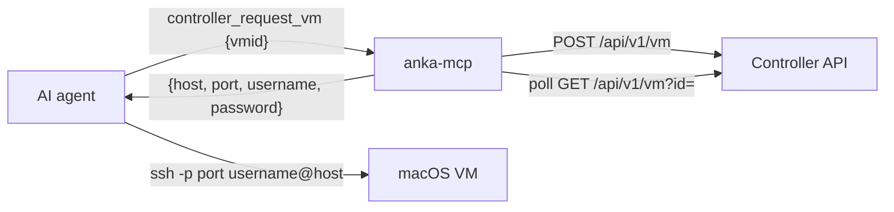

# anka-mcp

A [Model Context Protocol](https://modelcontextprotocol.io) (MCP) server for [Anka](https://veertu.com/) macOS virtualization. It runs as a **streamable HTTP server** with bearer-token auth and exposes two curated, purpose-built tool sets that auto-enable based on configuration:

- **Controller backend** - talks to the [Anka Build Cloud Controller](https://docs.veertu.com/anka/anka-build-cloud/working-with-controller-and-api/) REST API to request a VM from a fleet and hand back SSH connection details. No `anka` CLI is used.
- **Local backend** - drives the local `anka` CLI with a small, safe set of lifecycle commands, guarded by a running-VM limit.

There is intentionally no generic "run any anka command" tool.

## Backends and when they enable

| Backend    | Enabled when                                              | Tools |
| ---------- | --------------------------------------------------------- | ----- |
| Controller | `ANKA_CONTROLLER_URL` is set                              | `controller_list_templates`, `controller_request_vm`, `controller_get_vm`, `controller_terminate_vm` |
| Local      | `ANKA_LOCAL=on`, or `auto` when no controller is configured (detects the `anka` CLI) | `local_list_templates`, `local_start_vm`, `local_show_vm`, `local_ssh_access`, `local_delete_vm` |

When `ANKA_CONTROLLER_URL` is set, the local backend defaults to **off** so only controller tools are exposed. Set `ANKA_LOCAL=on` or `ANKA_LOCAL=auto` to enable both. The server refuses to start if neither backend is enabled.

## Requirements

- Node.js >= 18
- For the local backend: the `anka` CLI installed and on `PATH` (or point `ANKA_BIN` at it)
- For the controller backend: network access to an Anka Build Cloud Controller

## Install, build, run

```bash
npm install
npm run build
export MCP_AUTH_TOKEN="$(openssl rand -hex 32)"
echo "MCP_AUTH_TOKEN=$MCP_AUTH_TOKEN"
npm start
```

The endpoint is served at `http://<host>:<port>/mcp`. For local dev without auth (never expose beyond localhost):

```bash
MCP_ALLOW_NO_AUTH=1 npm run dev
```

## Use-case 1: Controller fleet

The agent asks the MCP server for a VM; the server starts it on the controller, waits until it is running and SSH-reachable, and returns the host IP and forwarded SSH port plus credentials. The agent then SSHes in itself.



The VM template must expose port forwarding for the SSH guest port (default `22`, e.g. a `port-forward-22` tag), or pass `addSshPortForward: true` to `controller_request_vm` to add a rule at start time.

## Use-case 2: Local laptop

The agent manages VMs on the developer's own machine through a limited command set: list templates, start (which always clones the chosen template into a fresh VM so the original is never touched), show, prepare SSH access, delete. A running-VM limit (default 2) prevents exceeding the local Anka concurrency limit. The delete tool always requires a specific VM name and can never delete all VMs.

For SSH, `local_ssh_access` generates a throwaway ed25519 keypair on the host, copies the public key into the running VM with `anka cp`, installs it into the VM's `~/.ssh/authorized_keys` (via `anka run`), and returns the private key path plus a ready-to-use `ssh` command. The agent (on the same machine) then connects directly to the VM's shared-network IP. The VM template must have Remote Login (sshd) enabled.

## Configuration

All configuration is via environment variables.

### HTTP transport + auth

| Variable              | Default   | Description                                                            |
| --------------------- | --------- | --------------------------------------------------------------------- |
| `MCP_HTTP_PORT`       | `9111`    | Port the HTTP server listens on.                                      |
| `MCP_HTTP_HOST`       | `0.0.0.0` | Interface to bind to.                                                 |
| `MCP_AUTH_TOKEN`      | (none)    | Bearer token clients must present. Required unless `MCP_ALLOW_NO_AUTH`. |
| `MCP_ALLOW_NO_AUTH`   | `false`   | Set to `1` to run unauthenticated (local dev only).                   |
| `MCP_ALLOWED_ORIGINS` | (none)    | Comma-separated Origin allow-list for DNS-rebinding protection.       |
| `MCP_LOG`             | `on`      | Request logging to stderr. Set to `off` (or `0`/`false`/`no`) to disable. |

When logging is enabled, each MCP request is written to stderr with the client source (IP and user-agent), JSON-RPC method, tool name and arguments, tool response (with passwords and private keys redacted), and any underlying `anka` or controller API calls. Example:

```
anka-mcp: 2026-06-22T16:52:15.021Z [127.0.0.1 (Cursor/1.x)] mcp tools/call {"tool":"local_list_templates","args":{}}
anka-mcp: 2026-06-22T16:52:15.059Z [127.0.0.1 (Cursor/1.x)] anka anka -j list -> ok
anka-mcp: 2026-06-22T16:52:15.059Z [127.0.0.1 (Cursor/1.x)] tool local_list_templates args={} -> {"vms":[...]}
```

### Controller backend

| Variable                          | Default  | Description                                                        |
| --------------------------------- | -------- | ------------------------------------------------------------------ |
| `ANKA_CONTROLLER_URL`             | (none)   | Base URL, e.g. `http://anka.controller:8090`. Enables the backend. |
| `ANKA_CONTROLLER_AUTH`            | (none)   | Raw `Authorization` header value (root token / UAK / Basic).       |
| `ANKA_CONTROLLER_TLS_INSECURE`    | `false`  | Set to `1` to skip TLS certificate verification.                   |
| `ANKA_CONTROLLER_POLL_INTERVAL_MS`| `3000`   | Interval between instance-status polls.                            |
| `ANKA_CONTROLLER_START_TIMEOUT_MS`| `180000` | Max time to wait for a VM to become SSH-ready.                     |

### Local backend

| Variable             | Default | Description                                                  |
| -------------------- | ------- | ------------------------------------------------------------ |
| `ANKA_LOCAL`         | `auto`* | `auto` (detect the binary), `on`, or `off`. \*Defaults to `off` when `ANKA_CONTROLLER_URL` is set. |
| `ANKA_BIN`           | `anka`  | Path to (or name of) the anka binary.                        |
| `ANKA_TIMEOUT_MS`    | `300000`| Max time a single anka invocation may run.                   |
| `ANKA_LOCAL_MAX_VMS` | `2`     | Max running VMs allowed before start is refused.            |
| `ANKA_LOCAL_POLL_INTERVAL_MS` | `2000` | Interval between status polls while waiting for a VM's IP. |
| `ANKA_LOCAL_IP_TIMEOUT_MS` | `120000` | Max time `local_start_vm`/`local_ssh_access` wait for an IP. |

### SSH connection details (returned to the agent)

| Variable              | Default | Description                                          |
| --------------------- | ------- | ---------------------------------------------------- |
| `ANKA_VM_SSH_USER`    | `anka`  | Username returned for SSHing into a VM.              |
| `ANKA_VM_SSH_PASSWORD`| `admin` | Password returned for SSHing into a VM.              |
| `ANKA_VM_SSH_GUEST_PORT` | `22` | Guest port that maps to SSH (matched in port forwarding). |

For production, terminate TLS in front of this server so the bearer token and any returned credentials are not sent in cleartext.

## Tools

### Controller

- `controller_list_templates` - list registry templates (`id`, `name`, `arch`) to find a `vmid`.
- `controller_request_vm` `{ vmid, tag?, name?, externalId?, addSshPortForward? }` - start one VM, wait until SSH-ready, return `{ instance_id, ssh: { host, port, username, password }, vminfo }`.
- `controller_get_vm` `{ instance_id }` - current state and SSH details for an existing instance.
- `controller_terminate_vm` `{ instance_id }` - terminate an instance.

### Local

- `local_list_templates` - list the local VM library to find a template to clone from.
- `local_start_vm` `{ template, name?, wait?, timeoutSeconds? }` - clone the given template into a fresh, disposable VM and start it. The original template is never started or modified. `name` defaults to an auto-generated name (`mcp-<id>`). Subject to the running-VM limit. By default waits for the new VM to boot and obtain an IP, then returns `{ ok, name, source, ip }`; pass `wait: false` to return immediately. Delete with `local_delete_vm` when done.
- `local_show_vm` `{ name }` - get a VM's IP address.
- `local_ssh_access` `{ name }` - install a temporary SSH key into a running VM (waiting for a pending IP if needed); returns `{ ip, port, user, private_key_path, command }`.
- `local_delete_vm` `{ name }` - delete one specific VM.

VM/template names that start with `-` are rejected so a name can never be reinterpreted as a CLI flag.

## Connecting a client

Point any MCP client that supports streamable HTTP at `http://<host>:<port>/mcp` with the bearer token. For example, Cursor's `mcp.json`:

```json
{
  "mcpServers": {
    "anka": {
      "url": "http://your-host:9111/mcp",
      "headers": {
        "Authorization": "Bearer YOUR_TOKEN"
      }
    }
  }
}
```

## Testing

```bash
npm test           # run the suite once
npm run test:watch # watch mode
```

The suite (Vitest) is hermetic - it needs neither a real Anka install nor a controller:

- Unit tests cover config parsing, the controller client + `extractSsh`/`isSshReady` (against an in-process mock controller), and input validation / output shaping.
- End-to-end tests spawn the real server over HTTP and exercise tools through the MCP protocol, using a fake `anka` binary ([test/fixtures/fake-anka.mjs](test/fixtures/fake-anka.mjs)) and a mock controller ([test/helpers/controllerMock.ts](test/helpers/controllerMock.ts)). They verify auth, backend gating, per-backend tool exposure, the controller request->SSH flow, the local 2-VM guard, flag-injection rejection, and the SSH key-injection flow.

## Adding new tools

1. Create a file under `src/tools/controller/` or `src/tools/local/` exporting a tool via `defineTool({ name, config, handler })`.
2. Add it to the array in that backend's `index.ts` (`controllerTools` or `localTools`). It is then auto-registered whenever that backend is enabled.

## Project layout

```
src/
  index.ts                 # entry: starts the HTTP server
  config.ts                # env-driven config + backend detection
  anka.ts                  # runAnka(): execFile wrapper + JSON-envelope parsing
  controller.ts            # Anka Build Cloud Controller API client
  server.ts                # createServer(): McpServer + registerTools
  tools/
    define-tool.ts         # defineTool helper + jsonResult
    index.ts               # registers enabled backends' tools
    controller/            # controller_* tools
    local/                 # local_* tools (+ vms.ts: list/count/guard/name schema)
  transports/
    http.ts                # streamable HTTP transport + auth/origin middleware
test/
  fixtures/fake-anka.mjs   # fake anka CLI for hermetic local-backend tests
  helpers/                 # mock controller + MCP-over-HTTP client
  unit/                    # config, controller client, validation/shaping
  e2e/                     # full server over HTTP (auth, controller, local)
```
